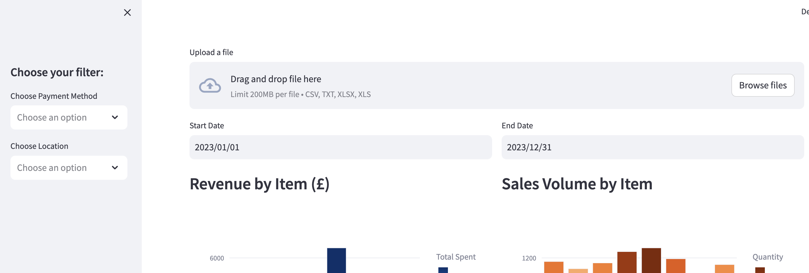
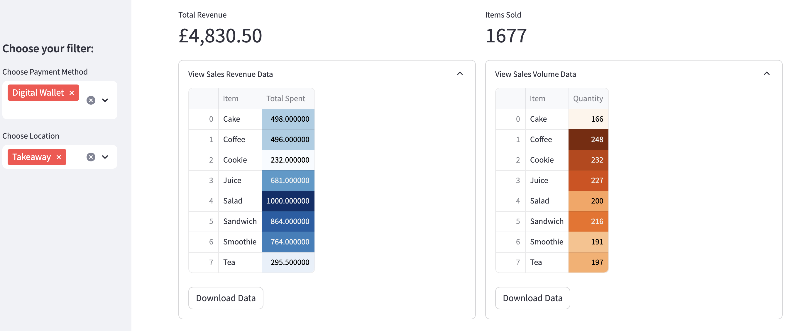
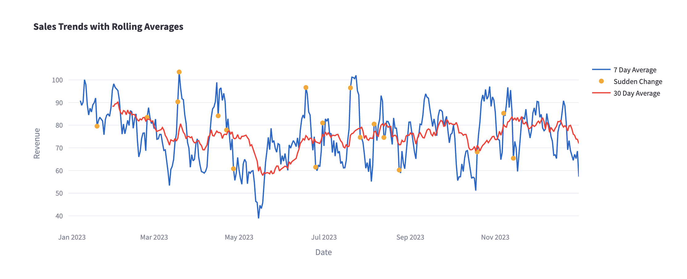

# ☕ Cafe Sales Analytics Dashboard

An interactive data analytics project built with **Python and Streamlit** that analyzes cafe sales data. The project includes data cleaning, exploratory data analysis (EDA), and a fully interactive dashboard that allows users to upload datasets and explore key business metrics in real time.

---

## 📊 Project Overview

This project takes raw cafe sales data and transforms it into actionable business insights. It includes:

- Data cleaning and preprocessing
- Exploratory Data Analysis (EDA)
- KPI calculations (revenue, total sales, etc.)
- Interactive dashboard built with Streamlit
- Dynamic filtering (date, payment method, location)
- Time series analysis with rolling averages
- Anomaly detection on sales trends

---

## 🚀 Dashboard Features

The Streamlit dashboard allows users to:

### 📈 Key Metrics
- Total revenue
- Total number of sales
- Revenue by item
- Sales volume by item

### 📅 Time Series Analysis
- Daily sales trends
- 7-day rolling average
- 30-day rolling average
- Automatic detection of sudden changes in trends

### 🧾 Breakdown Analysis
- Revenue by payment method
- Revenue by location (dine-in vs takeaway)

### 🎛️ Interactive Filters
- Date range filter
- Payment method filter
- Location filter
- Combined filters supported

---

## 🧹 Data Processing

The dataset was cleaned and transformed by:

- Handling missing values
- Converting date columns to datetime format
- Standardizing categorical variables
- Creating calculated fields (revenue, etc.)

---

## 📸 Screenshots

### 🔧 Filter Options
This section shows the available interactive filters (date range, payment method, and location) that allow users to explore and segment the dataset dynamically.



---

### 🎛️ Filters Applied
Demonstrates how multiple filters can be combined to dynamically update all KPIs and visualizations in real time.



---

### 📊 Revenue & Sales Overview (Bar Charts)
This visualization shows both **total revenue by item** and **total sales volume by item**, helping identify top-performing products.


---

### 📈 Rolling Average Trend Analysis
Shows the 7-day and 30-day rolling averages of sales, highlighting trends and smoothing short-term fluctuations in the data.



---

## 📁 Project Structure

```text
sales-dashboard/
│
├── data/
│   ├── sales.csv
│   └── sales_cleaned.csv
│
├── notebooks/
│   ├── 01_data_cleaning.ipynb
│   └── 02_eda.ipynb
│
├── screenshots/
│   ├── filter_options.png
│   ├── filters_applied.png
│   ├── barchart.png
│   └── rolling_average.png
│
├── dashboard.py
│
├── requirements.txt
└── README.md